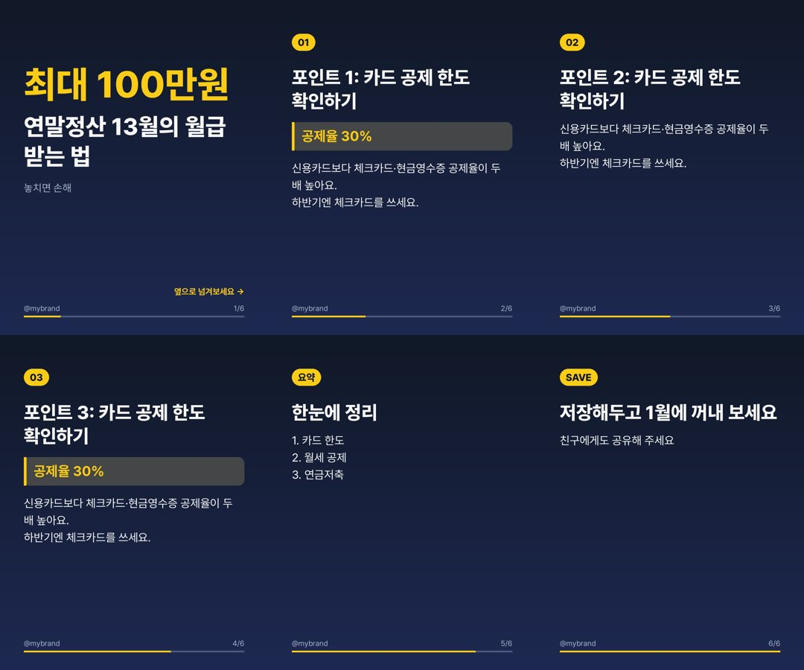

# 트렌드 카드뉴스 자동 발행 봇

실시간 트렌드를 모아 **조회수가 잘 나올 주제를 추천**하고, 카드뉴스(인스타 캐러셀 1080×1350)를 **만들어서 Instagram·Threads에 발행**까지 하는 프로그램입니다.
게시 후 성과(조회수·저장·공유)를 다시 수집해 다음 주제 추천에 반영합니다.

```
트렌드 수집 ─▶ 주제 추천 ─▶ 웹 검색 자료조사 ─▶ 원고 작성 ─▶ 이미지·릴스 렌더링 ─▶ 공개 URL 업로드 ─▶ IG/릴스/Threads 게시
 (Google Trends,   (Claude/Gemini, (Claude 웹검색 /      (Claude/Gemini,  (Pillow,          (GitHub/S3/     (Graph API
  Google News,      과거 성과 반영)  Google 검색)          구조화 출력)      Pretendard 폰트)   로컬)            캐러셀)
  YouTube, RSS)          ▲                                                                                     │
                         └──────────────────────── 성과 지표(views/saves/shares) 수집 ◀──────────────────────────┘
```



## 설치

```bash
cd cardnews-bot
python -m venv .venv && source .venv/bin/activate
pip install -r requirements.txt
cp .env.example .env   # 값 채우기
```

폰트(Pretendard, OFL 라이선스)는 처음 렌더링할 때 `fonts/`에 자동으로 받아집니다.

### AI 모델 선택: Claude 또는 Gemini

`LLM_PROVIDER`로 주제 추천·자료 조사·원고 작성에 쓸 모델을 고릅니다. 이미지 렌더링과 게시는 똑같이 동작합니다.

| | `LLM_PROVIDER=claude` (기본) | `LLM_PROVIDER=gemini` |
|---|---|---|
| API 키 | `ANTHROPIC_API_KEY` ([console.anthropic.com](https://console.anthropic.com)) | `GEMINI_API_KEY` ([aistudio.google.com/apikey](https://aistudio.google.com/apikey)) |
| 모델 | `ANTHROPIC_MODEL` (기본 `claude-opus-5`) | `GEMINI_MODEL` (기본 `gemini-flash-latest`) |
| 자료 조사 | Claude 웹 검색 도구 | Google 검색 그라운딩 |
| 비용 | 선불 충전 | 무료 등급 있음 (한도·조건은 AI Studio에서 확인) |

두 모델을 비교하려면 같은 주제로 각각 초안을 만들어 보세요:
```bash
LLM_PROVIDER=claude python -m cardbot make --topic "연말정산 꿀팁"
LLM_PROVIDER=gemini python -m cardbot make --topic "연말정산 꿀팁"
```
Gemini 무료 등급은 입력한 내용이 Google 제품 개선에 쓰일 수 있습니다. 민감한 내용은 넣지 마세요.

## 사용법

```bash
python -m cardbot trends               # 지금 수집되는 트렌드 신호 보기
python -m cardbot recommend -n 5       # 조회수 잘 나올 주제 TOP 5 (점수·이유·리스크 포함)
python -m cardbot make                 # 1순위 주제로 카드뉴스 초안 생성 → output/<폴더>
python -m cardbot make --pick 2        # 2순위 주제로
python -m cardbot make --topic "청년도약계좌 해지 조건" --angle "오해와 진실"
python -m cardbot publish output/<폴더>  # 검토 후 게시 (caption.txt / threads.txt 수정 가능)
python -m cardbot blog output/<폴더>     # 블로그 글 초안 다시 만들기
python -m cardbot run --publish        # 추천→제작→게시 한 번에
python -m cardbot auto --publish       # INTERVAL_MINUTES마다 반복 (성과 수집 포함)
python -m cardbot insights             # 성과 지표 갱신 + 상위 게시물 보기
python -m cardbot refresh-token instagram   # 장기 토큰(60일) 갱신
```

`output/<폴더>`에는 `slide_01.jpg…`, `card.json`(원고), `caption.txt`, `threads.txt`, `research.md`(출처 포함 팩트 시트), `published.json`(게시 결과)이 저장됩니다.

### 인스타그램 릴스

카드뉴스를 만들 때 같은 슬라이드로 **세로 영상(1080×1920, 약 20~25초)**도 만들어 `reel.mp4`로 저장하고, 게시할 때 인스타그램 릴스로 함께 올립니다 (피드에도 공유).
글자 수에 맞춰 한 장 2.5~4초씩(제목·강조 문구는 읽고 본문은 훑어볼 정도) 보여줍니다. 모든 장을 같은 시간으로 하려면 `REELS_SECONDS_PER_SLIDE=3`처럼 지정하세요. `PLATFORMS`에서 `reels`를 빼면 끌 수 있습니다.

- **배경음악**: API로는 인스타그램 음악 라이브러리를 쓸 수 없어서, 기본(`REELS_AUDIO=auto`)으로 **잔잔한 배경음악을 게시물마다 직접 합성**해 넣습니다 (부드러운 화음 + 피아노풍 아르페지오, 게시물마다 키·코드 진행·빠르기가 달라짐, 저작권 걱정 없음). 가진 음원을 쓰려면 저장소에 `cardnews-bot/assets/music/` 같은 폴더를 만들어 mp3를 넣고 `REELS_AUDIO=assets/music`으로 지정하세요 (폴더면 게시물마다 그중 하나를 고름). 무음은 `REELS_AUDIO=none`.
- **영상 호스팅**: GitHub raw 주소는 영상 형식을 알려주지 않아서, jsDelivr CDN 주소를 먼저 쓰고 실패하면 raw 주소로 다시 시도합니다.
- 스레드에는 카드뉴스(이미지)만 올립니다.

### 블로그 글 초안 (네이버 블로그 · 티스토리)

카드뉴스를 만들 때마다 **같은 주제의 검색용 블로그 글 초안**도 함께 만듭니다 (`BLOG_ENABLED=false`로 끌 수 있음).
블로그 기능 이전에 만든 초안은 게시할 때 자동으로 채워지고, `python -m cardbot blog output/<폴더>`로 다시 만들 수 있습니다.

| 파일 | 용도 |
|---|---|
| `blog_naver.txt` | 네이버 스마트에디터에 붙여넣기 ('■'는 소제목) |
| `blog_tistory.html` | 티스토리 에디터 **HTML 모드**에 붙여넣기 |
| `blog_guide.md` | 제목 후보, 핵심·보조 키워드, 요약문, 태그, 게시 체크리스트 |

두 플랫폼 모두 공식 글쓰기 API가 없어서(티스토리 오픈 API는 2024년 종료) **자동 게시는 하지 않습니다.**
📷 표시에 카드뉴스 이미지를 넣고, ✍️ 표시에 **직접 겪은 경험·의견**을 덧붙인 뒤 게시하거나 임시저장하세요.
검색엔진은 사람이 직접 쓴 경험을 높게 평가하므로, AI 초안을 그대로 올리는 것보다 노출과 수익화에 유리합니다. 상위노출이나 홈판 노출은 보장되지 않습니다.
게시가 한 플랫폼에서만 실패하면 같은 `publish` 명령을 다시 실행하면 실패한 쪽만 재시도합니다.

### 완전 자동 운영

기본값은 **초안만 만들고 게시는 하지 않습니다** (`AUTO_PUBLISH=false`). 몇 번 결과물을 검토해 보고 품질이 만족스러우면 켜세요.
서버에서 cron으로 돌리는 예시 (하루 3번):

```cron
10 8,12,19 * * * cd /path/cardnews-bot && .venv/bin/python -m cardbot auto --once --publish >> data/cron.log 2>&1
```

### GitHub Actions로 자동 운영 (PC 없이)

`.github/workflows/cardnews.yml`이 하루 1번(KST 19:10) 실행됩니다. 시간을 바꾸려면 워크플로의 `cron` 줄을 고치세요 (UTC 기준, KST에서 9시간을 뺀 값).
발행 이력 DB·초안·게시용 이미지는 코드와 분리된 **`cardbot-data` 브랜치**에 자동 커밋되어 다음 실행에 이어집니다.

1. 이 브랜치를 기본 브랜치(`main`)에 병합하세요. 예약 실행은 기본 브랜치에 있는 워크플로만 동작합니다.
2. 저장소 **Settings → Secrets and variables → Actions** 에 등록:
   - **Secrets**: `ANTHROPIC_API_KEY`(또는 Gemini를 쓰면 `GEMINI_API_KEY`), `IG_USER_ID`, `IG_ACCESS_TOKEN`, `THREADS_USER_ID`, `THREADS_ACCESS_TOKEN` (선택: `YOUTUBE_API_KEY`)
   - **Variables** (선택, 비우면 기본값): `CARD_NICHE`, `CARD_TONE`, `BRAND_HANDLE`, `CARD_THEME`, `PLATFORMS`, `POSTS_PER_RUN`, `LLM_PROVIDER`, `ANTHROPIC_MODEL`, `GEMINI_MODEL`, `CARD_EFFORT`, `AUTO_PUBLISH`
3. 처음엔 `AUTO_PUBLISH`를 설정하지 마세요. 예약 실행이 **초안만** 만들고, 실행 결과 화면(Summary)에 슬라이드 미리보기·캡션이 표시됩니다.
   마음에 들면 **Actions → 카드뉴스 자동 발행 → Run workflow** 에서 `publish-draft`를 고르고 폴더 이름을 넣어 게시합니다.
4. 품질이 안정되면 Variables에 `AUTO_PUBLISH=true`를 추가 → 예약 실행이 바로 게시까지 합니다.

수동 실행(Run workflow) 옵션: `draft`(초안, 주제 직접 지정 가능) · `publish-now`(추천→제작→즉시 게시) · `publish-draft`(검토한 초안 게시) · `blog`(초안의 블로그 글 다시 만들기)

실행 결과 화면(Summary)에 블로그 글 초안 링크(네이버용·티스토리용·게시 가이드)가 함께 표시되고, 아티팩트 zip에도 들어 있습니다.

**이미지 호스팅**: 기본으로 이 저장소(공개)의 `cardbot-data` 브랜치 `images/`에 올리고 기본 제공 토큰을 씁니다. 저장소가 비공개라면 공개 저장소를 따로 만들어
Variables에 `IMAGE_REPO=owner/repo`, Secrets에 `CARDBOT_GITHUB_TOKEN`(그 저장소 Contents 쓰기 권한 PAT)을 넣으세요.

**토큰 자동 갱신**: `.github/workflows/cardnews-refresh-tokens.yml`이 매달 1일 인스타·스레드 토큰을 갱신해 Secrets에 다시 저장합니다.
이 저장소에 대해 *Secrets: Read and write* 권한만 준 fine-grained PAT을 `CARDBOT_ADMIN_TOKEN` 시크릿으로 등록해야 동작합니다.

참고: 공개 저장소는 60일간 활동이 없으면 예약 실행이 자동으로 꺼질 수 있습니다 (GitHub이 메일로 알려주며 Actions 탭에서 다시 켤 수 있음).

## 사전 준비 (Meta 쪽)

1. **Instagram**: 프로페셔널(비즈니스/크리에이터) 계정 → [Meta for Developers](https://developers.facebook.com/)에서 앱 생성 → *Instagram API with Instagram Login* 추가 →
   `instagram_business_basic`, `instagram_business_content_publish`, `instagram_business_manage_insights` 권한으로 장기 토큰 발급 → `IG_USER_ID`, `IG_ACCESS_TOKEN`
2. **Threads**: 같은 앱에 *Threads API* 추가 → `threads_basic`, `threads_content_publish`, `threads_manage_insights` 권한 → `THREADS_USER_ID`, `THREADS_ACCESS_TOKEN`
3. 본인 계정에만 게시한다면 앱 검수 없이 개발 모드(테스터 등록)로 사용 가능합니다.
4. 토큰은 60일마다 만료되니 `refresh-token` 명령을 주기적으로(예: 월 1회) 실행하세요.

**이미지 호스팅**: 두 API 모두 파일 업로드가 아니라 공개 URL에서 이미지를 가져갑니다.
가장 간단한 방법은 **공개 GitHub 저장소**를 하나 만들어 `IMAGE_HOSTING=github`으로 쓰는 것입니다 (`GITHUB_TOKEN`은 해당 저장소 Contents 쓰기 권한만 주세요).
트래픽이 많아지면 Cloudflare R2(`IMAGE_HOSTING=s3`, `pip install boto3`)를 권장합니다.

## 추천 로직

- **신호**: Google Trends 실시간 인기 검색어(검색량 추정치 + 관련 기사), Google News 주요 기사, (선택) YouTube 인기 동영상 조회수, (선택) 원하는 RSS
- **판단**: AI 모델(Claude/Gemini)이 계정 니치(`CARD_NICHE`), 신호 규모, 카드뉴스로 풀었을 때 저장·공유 가치, 과거 잘 된 게시물 패턴을 보고 0~100점으로 순위를 매깁니다. 최근 14일 안에 다룬 주제는 제외합니다.
- **안전장치**: 참사·사건 피해자 소비, 개인 루머, 미확인 의혹, 정치 편가르기, 근거 없는 의료·투자 조언은 피하도록 지시하고, 주제마다 리스크를 표시합니다. 원고는 웹 검색 팩트 시트에 근거하고 출처를 `research.md`에 남깁니다.

## 비용과 설정

- AI 호출은 게시물 1건당 4회(추천·조사·카드뉴스 원고·블로그 글)입니다. Claude는 `CARD_EFFORT=medium`이나 `ANTHROPIC_MODEL=claude-sonnet-5`로, 또는 `LLM_PROVIDER=gemini`로 비용을 줄일 수 있습니다. (`CARD_EFFORT`는 Claude에만 적용)
- `CLAUDE_FALLBACKS=default`는 Claude가 요청을 거절할 경우 Anthropic 서버에서 다른 모델로 자동 재시도하는 옵션입니다 (Claude API 전용, Bedrock/Vertex에서는 `off`).
- 인스타그램 API 게시 한도는 24시간에 게시물 50개입니다.

## 테스트

```bash
pip install pytest
python -m pytest -q tests
```

외부 API(Claude, Gemini, Google, Meta)는 테스트에서 모두 모킹되어 있어 키 없이 실행됩니다.
